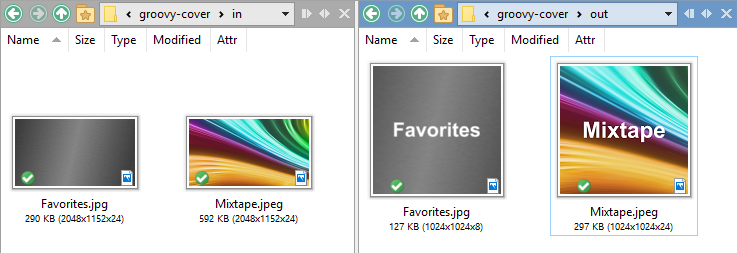
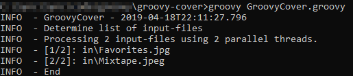

# GroovyCover
A small Groovy Script for quickly generating many Album-Covers.

## Features and Usage
Assume you want to create a couple of Album or Playlist Covers, e.g. for music-streaming services.
All you have to do is:
1. Find some nice images, and store these in the `in` directory.
2. Name each image-file - e.g. `My Playlist.jpg` and `Mixtape.jpeg`.
3. Run GroovyCover using: `groovy GroovyCover.groovy`
4. GroovyCover creates the album-covers in the `out` directory, which are correctly sized, cropped and have the file-name (without extension) overlayed in bold.

*Remarks:*
1. GroovyCover is multi-threaded and scales with the host's core-count.
2. The source-code is really small at ca. 150 LLOC.
3. You can customize the text-color, font-type and other aspects via CLI arguments. Call with -h to view usage-information.
4. Tested with Groovy 2.5 and ImageMagick 7.

## Screenshots
Side-by-side view of inputs and outputs:

Sample console-output:

## Prerequisites & Compatibility
GroovyCover uses [Groovy](http://groovy-lang.org) and [ImageMagick](https://www.imagemagick.org) - and requires both on the $PATH.

It doesn't matter how you install these dependencies, but some suggestions are:
* Windows: Get [Chocolatey](https://chocolatey.org) and run "choco install groovy imagemagick".
* Debian/Ubuntu: Run "sudo apt-get install groovy imagemagick".

GroovyCover was tested with:
* Groovy 3.0 and 2.5 on Zulu 13 and 11
* ImageMagick 7

## Authors & Affiliations
* **Lukas Kästner** - *Initial work* - [lkaestner.com](https://lkaestner.com)
* no affiliations to ImageMagick or Groovy

## License
This project is licensed under the MIT License. See the [LICENSE](LICENSE) file for details.

